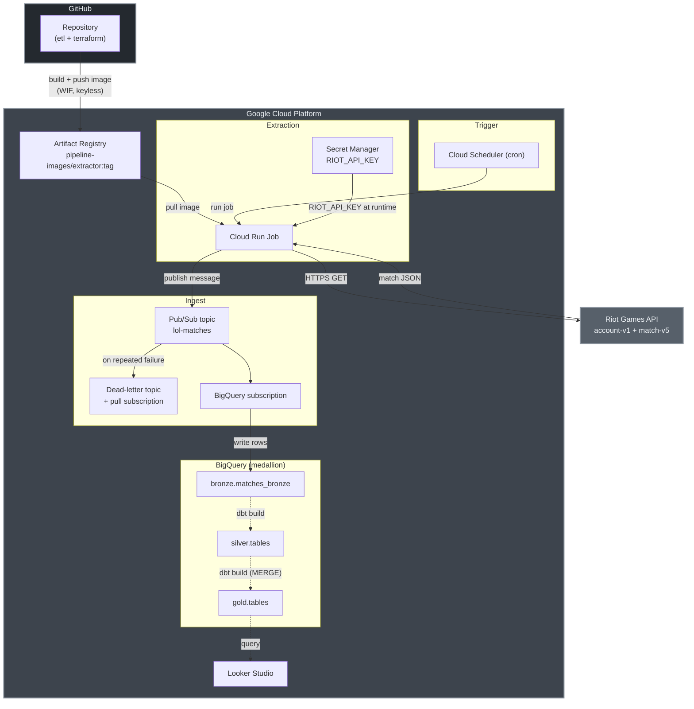
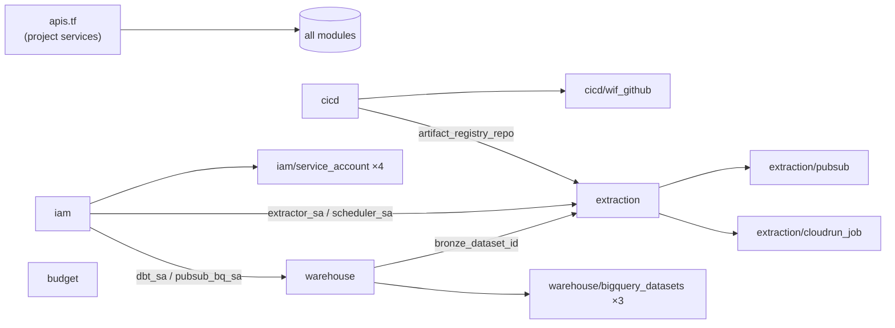
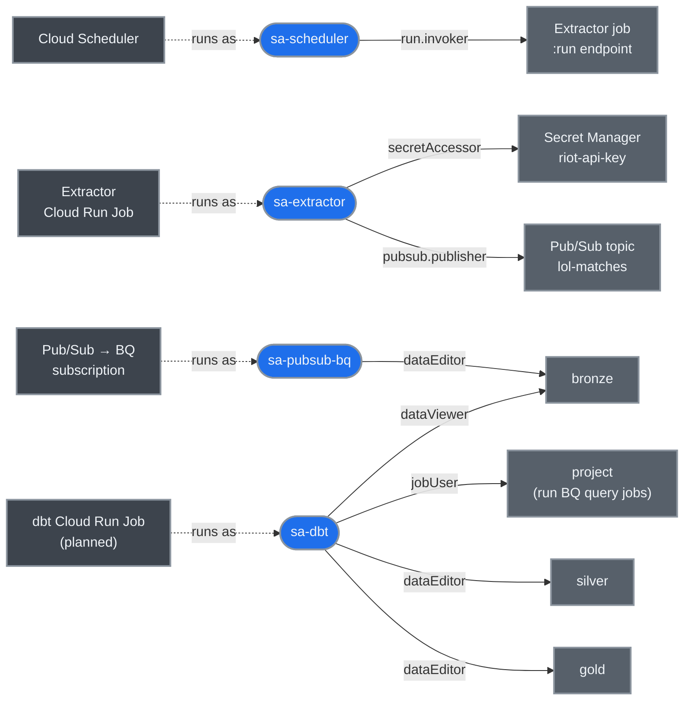
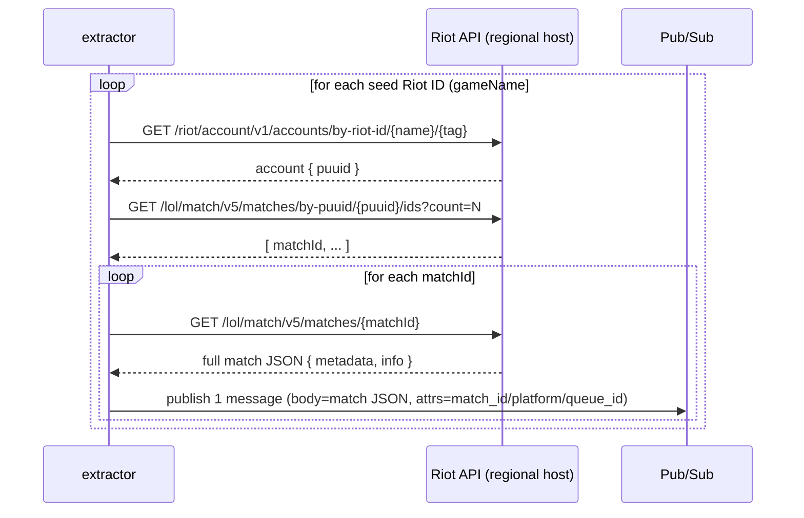

# gcp-demo-pipeline

A Terraform-provisioned data pipeline on Google Cloud that extracts League
of Legends match data from the Riot Games API. This is a MVP working demo and not a full solution with data governance, scalability and any other buzz words.

## Architecture



### How the pieces fit (detail)

**1. Schedule → run.** A **Cloud Scheduler** job fires on a cron (`*/30 * * * *`
by default). It authenticates as `sa-scheduler` and calls the Cloud Run Admin
API's `:run` endpoint on the extractor job. (Cloud Run **Jobs** require
`run.jobs.run`; the `run.invoker` role only covers Services.) Between ticks the
job is fully scaled to zero — you pay only for the seconds it executes.

**2. Extract.** The **extractor Cloud Run Job** (Python, image pulled from
Artifact Registry) runs as `sa-extractor`. It reads the Riot API key from
**Secret Manager** at runtime via `secret_env` — the key is _never_ baked into
the image or the job spec. It then calls the Riot API (see
[The extractor](#the-extractor) below).

**3. Ingest.** For every match it fetches, the job publishes **one message** to
the **Pub/Sub topic** `lol-matches`: the message body is the full match JSON, and
attributes carry `match_id`, `platform`, and `queue_id`. Pub/Sub decouples the
bursty extractor from the warehouse and gives at-least-once delivery; messages
that repeatedly fail land on a **dead-letter topic** for manual inspection.

**4. Land (no code).** A **Pub/Sub → BigQuery subscription** writes messages
straight into `bronze.matches_bronze` — no Dataflow, no consumer code. The `bronze` table
is partitioned by ingest date and its partitions **auto-expire after 30 days**:
bronze is a disposable, replayable bronze layer, not the source of truth.

**5. Transform & serve (planned).** A second Cloud Run Job running **dbt-core**
would parse the bronze JSON into a typed star schema (`silver.*` silver →
`gold.*` gold) via incremental `MERGE`, and **Looker Studio** would chart the
gold. The `silver`/`gold` datasets already exist (created by the `warehouse`
module) but nothing populates them yet.

**Region alignment.** Cloud Run, Scheduler, Pub/Sub, and Artifact Registry all
live in `us-central1`; BigQuery is in the `US` multi-region. These must stay
aligned — a Pub/Sub BigQuery subscription **cannot write across regions**.

### Storage: native BigQuery tables, not a GCS data lake

Every layer (`bronze`/`silver`/`gold`) is a **native BigQuery table** — data
lives in BigQuery's own managed columnar storage (Capacitor format on Colossus),
not in GCS buckets. We deliberately did **not** build a file-based data lake.

A lake-per-layer is possible on GCP — swap the BigQuery subscription for a
**Pub/Sub → Cloud Storage subscription** (writes messages straight to a bucket,
no code) and read each layer through external/BigLake tables. We skip it because:

- **Native tables are simpler and faster** — clustering, caching, and partition
  pruning come for free; external tables give up most of that.
- **dbt is native-table-first.** Materializing `silver`/`gold` as incremental
  `MERGE` models into managed tables is first-class; writing dbt output back out
  as GCS files is not. A pure-file lake would fight the transform layer.
- **At demo scale the lake's payoff (cheap open-format archive, engine
  portability) doesn't justify the added moving parts** — file partitioning,
  compaction, external-table refresh, BigLake/Iceberg setup and IAM.

If a replayable open-format raw archive is ever needed, the pragmatic hybrid is
to land only **bronze** in GCS (Cloud Storage subscription) and keep
`silver`/`gold` as dbt-built native tables — best of both with minimal extra
complexity.

---

## Repository layout

```
gcp-demo-pipeline/
├── terraform/
│   ├── environments/prod/      # the single root: wires modules together
│   │   ├── main.tf             # module composition
│   │   ├── apis.tf             # enables every project API once
│   │   ├── backend.tf          # GCS remote state
│   │   ├── providers.tf        # google provider (ADC, user_project_override)
│   │   ├── variables.tf
│   │   ├── outputs.tf
│   │   ├── terraform.tfvars    # non-secret config (committed)
│   │   └── common.auto.tfvars  # project_id + billing_account (git-ignored)
│   └── modules/                # reusable building blocks (see below)
│       ├── budget/
│       ├── cicd/               #   └ wif_github/          (nested helper)
│       ├── iam/                #   └ service_account/     (nested helper)
│       ├── warehouse/          #   └ bigquery_datasets/   (nested helper)
│       └── extraction/         #   └ cloudrun_job/ + pubsub/ (nested helpers)
├── etl/                        # data pipeline source
│   └── extraction/             # the Python extractor (Cloud Run Job source)
│       ├── league_of_legends/matches/{main,ingestor,producer}.py
│       ├── Dockerfile
│       ├── pyproject.toml / uv.lock
│       └── .env                # local dev only (git-ignored)
└── docs/                       # design specs
```

This is **plain Terraform** organised in the spirit of a Terragrunt
`infrastructure-live` repo — reusable `modules/` separated from a per-environment
root — but consolidated into a **single state file** (`prod`) for simplicity. The
root `main.tf` instantiates each module and passes values between them directly
(no `terraform_remote_state` wiring).

---

## Terraform modules

Every module is provider-only and stateless; the `environments/prod` root owns
the single state file and composes them. All depend on the project APIs enabled
once in `apis.tf`.

Generic helper modules are **nested inside the one composite that consumes them**
(e.g. `iam/service_account`); they're private building blocks, not meant to be
called directly from the root.

| Module                            | What it provisions                                                                                                                                                                                                                                                                                                                |
| --------------------------------- | --------------------------------------------------------------------------------------------------------------------------------------------------------------------------------------------------------------------------------------------------------------------------------------------------------------------------------- |
| **`budget`**                      | A monthly `google_billing_budget` cost-alert on the project. Alerts only (it never stops spend) at configurable thresholds (default 25% / 50% / 100% of the budget amount).                                                                                                                                                        |
| **`cicd`**                        | An **Artifact Registry** Docker repo (`pipeline-images`) for the container images, plus the deployer's `artifactregistry.writer` grant. Wraps `cicd/wif_github`.                                                                                                                                                                   |
| └ **`cicd/wif_github`**           | **Workload Identity Federation** for keyless GitHub Actions auth: an OIDC pool + provider (scoped to this exact repo via an attribute condition) and a `sa-gh-deployer` service account GitHub can impersonate. **No JSON keys.**                                                                                                  |
| **`iam`**                         | Creates the four runtime **service accounts** via `iam/service_account`: `sa-extractor`, `sa-dbt`, `sa-scheduler`, `sa-pubsub-bq`. Only genuinely project-wide roles are granted here; resource-scoped bindings live with the resources.                                                                                            |
| └ **`iam/service_account`**       | Generic helper: one `google_service_account` + optional project-level role bindings.                                                                                                                                                                                                                                              |
| **`warehouse`**                   | The three **BigQuery datasets** — `bronze` (bronze, 30-day table expiry), `silver` (silver), `gold` (gold) — via `warehouse/bigquery_datasets`, plus dataset-scoped IAM (Pub/Sub-BQ SA → editor on `bronze`; dbt SA → viewer on `bronze`, editor on `silver`/`gold`).                                                              |
| └ **`warehouse/bigquery_datasets`** | Generic helper: a single `google_bigquery_dataset` with optional default table expiration. Tables (and their partitioning/clustering) are created by the _writers_, not here.                                                                                                                                                    |
| **`extraction`**                  | The heart of the pipeline. Creates the `matches_bronze` landing table, the Riot-key **Secret Manager** secret (empty, scoped to `sa-extractor`), the Pub/Sub topic + DLQ + BQ subscription (via `extraction/pubsub`), and the **extractor Cloud Run Job + Scheduler** (via `extraction/cloudrun_job`). Grants `sa-extractor` `pubsub.publisher` on the topic. |
| └ **`extraction/pubsub`**         | Generic Pub/Sub landing: a topic, a **BigQuery subscription** that writes straight to a table, a dead-letter topic + subscription, and the Pub/Sub service-agent IAM needed for BQ writes and dead-lettering.                                                                                                                      |
| └ **`extraction/cloudrun_job`**   | Generic **Cloud Run v2 Job** + optional **Cloud Scheduler** trigger. Supports plain env vars, Secret Manager-backed env vars, command/args overrides, and CPU/memory/retry/timeout knobs. Reused by the extractor (and, when built, dbt).                                                                                          |

### Module wiring



---

## Identity & access (IAM)

GCP IAM is always one sentence: a **member** (the _who_) gets a **role** (the
_what_ — a bundle of permissions) on a **resource** (the _where_). The three
member types are distinct:

- **Users** — a human (`you@example.com`); logs in with a password + 2FA.
- **Groups** — a collection of users; grant a role once, every member inherits.
- **Service accounts (SA)** — a non-human identity for _code_
  (`sa-extractor@<project>.iam.gserviceaccount.com`). This is what the pipeline
  runs as; there are no humans in the data path.

Two things that routinely trip people up:

1. **Permissions belong to identities, not to resources.** `sa-dbt` having edit
   rights on BigQuery says nothing about what _you_ can do — they're separate
   identities with separate, non-overlapping grants.
2. **A new member starts with zero permissions.** A freshly-added human can't
   touch BigQuery (or anything) until an admin _explicitly_ binds a role to
   their email. They also can't borrow an SA's powers unless granted
   `iam.serviceAccountUser` / `serviceAccountTokenCreator` on that SA. The only
   way "anyone" gets broad access is the anti-pattern of handing out the basic
   `roles/owner` / `roles/editor` — which this project never does.

### Least privilege by design

The `iam` module only **mints the four runtime SAs** and grants the single
genuinely project-wide role (`bigquery.jobUser` on `sa-dbt`). Every
**resource-scoped** grant lives in the module that owns the resource — a role on
one topic, secret, job, or dataset, never project-wide:

| Service account  | Runs as the identity for  | Roles granted                                                                       | Scoped to                              | Granted in            |
| ---------------- | ------------------------- | ----------------------------------------------------------------------------------- | -------------------------------------- | --------------------- |
| **sa-extractor** | Extractor Cloud Run Job   | `secretmanager.secretAccessor`<br/>`pubsub.publisher`                               | `riot-api-key` secret<br/>`lol-matches` topic | `extraction`    |
| **sa-scheduler** | Cloud Scheduler trigger   | `run.invoker` (incl. `run.jobs.run`)                                                | the extractor job (`:run`)             | `extraction/cloudrun_job` |
| **sa-pubsub-bq** | Pub/Sub → BQ subscription | `bigquery.dataEditor`                                                               | `bronze` dataset                       | `warehouse`           |
| **sa-dbt**       | dbt Cloud Run Job _(planned)_ | `bigquery.jobUser` _(project-wide)_<br/>`bigquery.dataViewer`<br/>`bigquery.dataEditor` | project<br/>`bronze`<br/>`silver` + `gold` | `iam` + `warehouse` |

> The CD deployer (`sa-gh-deployer`) is **not** a runtime SA — it lives in the
> `cicd` / `wif_github` layer and is impersonated keylessly by GitHub Actions
> (WIF) to push images, with only `artifactregistry.writer`.

### Who can act on what



Each pipeline component **runs as** exactly one SA (dashed), and each SA holds
only the narrow grants (solid, labelled with the role) it needs for its single
job — nothing more.

---

## The extractor

Source: `etl/extraction/league_of_legends/matches/`. Run as a module from the repo
root: `python -m etl.extraction.league_of_legends.matches.main`.

### What it extracts from the Riot API

It collects **recent match data** for a small seed list of players. The Riot API
doesn't let you query "all matches," so discovery is player-driven: start from
known accounts and walk their recent match history.



**Endpoints used** (`ingestor.py`):

| Step       | Endpoint                                                 | Purpose                                                                                                                                 |
| ---------- | -------------------------------------------------------- | --------------------------------------------------------------------------------------------------------------------------------------- |
| Resolve    | `account-v1` `/accounts/by-riot-id/{gameName}/{tagLine}` | Riot ID → **PUUID** (summoner-name lookup is deprecated).                                                                               |
| Discover   | `match-v5` `/matches/by-puuid/{puuid}/ids`               | PUUID → list of recent **match IDs** (`start`, `count`, optional `queue`).                                                              |
| Fetch      | `match-v5` `/matches/{matchId}`                          | Full **match JSON** (`metadata` + `info`: 10 participants with champion, role, K/D/A, gold, damage, win, plus queue/duration/platform). |
| _(unused)_ | `match-v5` `/matches/{matchId}/timeline`                 | Per-minute event timeline — method exists (`get_match_timeline`) but isn't called in the main loop.                                     |

All three use the **regional routing host** (`americas` / `europe` / `asia` /
`sea`), set via `RIOT_REGIONAL_HOST` — _not_ the platform host (`na1`/`euw1`).

### What it does with the data

`producer.py` publishes **one Pub/Sub message per match**:

- **body** = the full match JSON (UTF-8),
- **attributes** = `match_id`, `platform` (`info.platformId`), `queue_id`
  (`info.queueId`).

In `--dry-run` it logs what it _would_ publish and never touches Pub/Sub (and
lazily skips importing the Pub/Sub client), so you can exercise it with no GCP.

### Resilience

- **Rate limits:** one naive retry on HTTP `429`, sleeping for the `Retry-After`
  header. (Riot dev keys allow ~20 req/s, 100 req/2 min.)
- **Fault tolerance:** per-player and per-match calls are wrapped in
  try/except — a bad player or match is logged and skipped, so one failure never
  crashes the whole run.

### Configuration

| Env var              | Required                 | Meaning                                               |
| -------------------- | ------------------------ | ----------------------------------------------------- |
| `RIOT_API_KEY`       | yes                      | Riot API token. In GCP, injected from Secret Manager. |
| `RIOT_REGIONAL_HOST` | yes                      | e.g. `https://americas.api.riotgames.com`.            |
| `PUBSUB_TOPIC`       | yes (unless `--dry-run`) | Full path `projects/<p>/topics/<t>`.                  |

| CLI flag    | Default | Meaning                                                    |
| ----------- | ------- | ---------------------------------------------------------- |
| `--count N` | `5`     | Matches to fetch per player (Terraform sets `--count 10`). |
| `--dry-run` | off     | Resolve + log, never publish.                              |

> **Note:** The seed list is currently the **placeholder** `["YourName#NA1"]` in
> `main.py`. Replace it with a real Riot ID (your own account is the safest test)
> before a real run, or it returns nothing. The design intends this list to come
> from config.

---

## Deploy

### Prerequisites

- `terraform` ≥ 1.5, `gcloud`, and Docker (with `buildx`) installed.
- A GCP project, a **GCS bucket** for Terraform state (referenced in
  `backend.tf`), and a billing account.
- Authenticated: `gcloud auth application-default login`.
- `terraform/environments/prod/common.auto.tfvars` present with your
  `project_id` and `billing_account` (git-ignored; auto-loaded by Terraform).

### Order of operations

Because a Cloud Run Job won't deploy until the image and secret it references
exist, the create-time order matters:

```bash
PROJECT=<your-project-id>
REGION=us-central1
IMAGE=$REGION-docker.pkg.dev/$PROJECT/pipeline-images/extractor:latest

# 1. Create the registry + secret resources first (they're cheap and have no
#    image/secret-value dependency). Targeted apply, or just run the full apply
#    once — it'll create these and then fail on the extractor; that's expected.
terraform -chdir=terraform/environments/prod init
terraform -chdir=terraform/environments/prod apply \
  -target=module.cicd -target=module.extraction.google_secret_manager_secret.riot_api_key

# 2. Build + push the extractor image (linux/amd64 — required by Cloud Run).
gcloud auth configure-docker $REGION-docker.pkg.dev
docker buildx build --platform linux/amd64 -f etl/extraction/Dockerfile -t "$IMAGE" --push .

# 3. Add the Riot API key value (dev keys expire ~daily — re-run to refresh).
echo -n "RGAPI-your-dev-key" | gcloud secrets versions add riot-api-key \
  --project=$PROJECT --data-file=-

# 4. Full apply — the extractor job now creates cleanly.
terraform -chdir=terraform/environments/prod apply
```

### Manual / out-of-band steps

These are intentionally **not** Terraform-managed:

1. **Riot API key value** — the secret is created empty; you add the value by
   hand and refresh it (~daily for a dev key).
2. **Container image** — currently built and pushed by hand (step 2). The
   intended GitHub Actions CD that would automate this is **not yet built**.
3. **Seed player list** — currently hardcoded in `main.py` (see warning above).

---

## Operating notes

- **Cost:** everything scales to zero; Scheduler + Pub/Sub are negligible;
  BigQuery is on-demand with a disposable, self-expiring `bronze` table. Realistic
  burn is a few dollars. The budget module emails alerts; the free-trial credit
  is the real hard stop.
- **Duplicates:** Pub/Sub is at-least-once, so a match may land more than once in
  `bronze`. The planned dbt incremental `MERGE` on `(match_id, participant_id)` is
  what will make the gold idempotent.
- **Dead-letter topic** has no consumer — failed messages accumulate for manual
  inspection.

---

## Roadmap

Designed in the spec, **not yet implemented**:

- **dbt transform layer** — a second `cloudrun_job` (dbt-core container) to
  build `silver.*` (silver) and `gold.*` (gold) with incremental `MERGE`,
  partitioning/clustering, and dbt tests. The datasets already exist.
- **GitHub Actions CI/CD** — keyless (WIF) image build + push on every push to
  `etl/extraction/**`, replacing the manual `docker buildx` step. The WIF pool,
  provider, and deployer SA are already provisioned by `cicd`/`wif_github`.
- **Looker Studio dashboards** — win rate by champion, KDA distributions,
  per-player scorecards (no Terraform provider exists; built in the console).
- **Match dedup** — a `seen_matches` lookup to skip already-fetched matches.
  </content>
